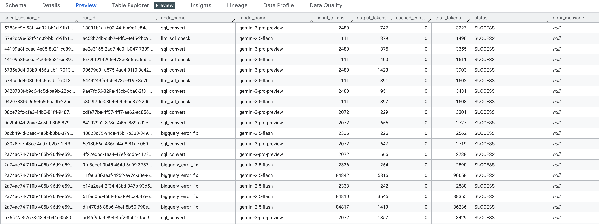

# Spark to BigQuery SQL Migration Agent

An intelligent, automated service designed to convert Spark SQL queries into BigQuery-compatible SQL. Built on top of **LangGraph**, it orchestrates a sophisticated workflow that goes beyond simple translation. It employs **Google Gemini** (Vertex AI) to understand dialect nuances, validates generated SQL using real BigQuery APIs (Dry Run), and iteratively fixes errors through a self-correction loop.


## ✨ Features

- **Spark SQL Validation**: Uses `sqlglot` to validate the syntax of input Spark SQL.
- **Intelligent Conversion**: Converts Spark SQL to BigQuery SQL, handling functions, data types, and syntax differences.
- **Smart Chunking**: Automatically splits large or complex queries (CTEs, Unions, etc.) into manageable chunks for high-quality translation.
- **Dry Run & Execution**: Leverages BigQuery's Dry Run for validation and Execution for result verification, ensuring SQL correctness before deployment.
- **Auto-Correction**: Automatically iterates to fix SQL errors by analyzing direct feedback (error messages) from BigQuery.
- **Data Verification**: Optional step to verify execution results against ground truth data (supports row count and full content comparison).

### Workflow Steps

1.  **Validate Spark SQL**: Checks if the input Spark SQL is syntactically valid using `sqlglot`.
2.  **Convert to BQ SQL**: Translates the Spark SQL to BigQuery dialect.
3.  **BigQuery Dry Run**: Validates the generated SQL using BigQuery's Dry Run API for syntax and schema correctness.
    -   *If correct*: Proceed to LLM Check.
    -   *If error*: Trigger **Auto-Correction** loop.
4.  **LLM Check**: Performs an additional semantic and safety check on the SQL.
    -   *If passed*: Proceed to Execution.
    -   *If issues found*: Trigger **Auto-Correction** loop.
5.  **Execute**: Executes the valid BigQuery SQL (e.g., creates the target table).
    -   *If execution fails* (runtime errors): Trigger **Auto-Correction** loop.
6.  **Auto-Correction**: Uses LLM to fix the SQL based on error messages (from Dry Run, LLM Check, or Execution), then loops back to **Dry Run**.
7.  **Data Verification**: Compares the execution results against ground truth tables (if verified) logic.


## 🚀 Installation

1. Create and activate a virtual environment:

```bash
python -m venv venv
source venv/bin/activate  # Linux/macOS
# OR
.\venv\Scripts\activate  # Windows
```

2. Install dependencies:

```bash
pip install -r requirements.txt
```

3. Configure environment variables:

```bash
cp env.example .env
# Edit .env file with your configurations
```

## ⚙️ Configuration

### LLM Configuration (Google Gemini / Vertex AI)
| Variable | Description | Default / Example |
|----------|-------------|-------------------|
| `GOOGLE_CLOUD_PROJECT` | GCP Project ID (uses ADC if unset) | - |
| `GOOGLE_CLOUD_LOCATION` | Vertex AI Location | `global` |
| `SQL_CONVERT_MODEL` | Model for SQL conversion | `gemini-3-pro-preview` |
| `LLM_SQL_CHECK_MODEL` | Model for SQL syntax checking | `gemini-3-pro-preview` |
| `BIGQUERY_ERROR_FIX_MODEL` | Model for error fixing | `gemini-3-pro-preview` |

### Engine Configuration
| Variable | Description | Default |
|----------|-------------|---------|
| `SQL_CHUNKING_MODE` | Strategy for splitting large SQL (`auto`, `always`, `disabled`) | `auto` |
| `MAX_SQL_LENGTH` | Character limit for triggering chunking | `8000` |
| `MAX_SQL_LINES` | Line limit for triggering chunking | `200` |
| `AUTO_FIX_MAX_RETRIES` | Max attempts to fix SQL errors | `10` |

### Data Verification
| Variable | Description | Values |
|----------|-------------|--------|
| `DATA_VERIFICATION_MODE` | Verification method | `row_count` or `full_content` |
| `DATA_VERIFICATION_ALLOWED_DATASET` | Safety check for allowed target dataset | - |

### Feature Toggles
| Variable | Description | Default |
|----------|-------------|---------|
| `EXECUTE_ENABLED` | Enable BigQuery execution step | `false` |
| `DATA_VERIFICATION_ENABLED` | Enable data verification step | `false` |

### Monitoring & Auditing
| Variable | Description | Default / Example |
|----------|-------------|-------------------|
| `MODEL_USAGE_LOG_TABLE` | BigQuery table for tracking LLM token usage | `project.dataset.usage_log` |
| `AGENT_TRACE_LOG_TABLE` | BigQuery table for agent execution tracing | `project.dataset.trace_log` |

### Connection Configuration
The service uses **Application Default Credentials (ADC)** for authentication.
Ensure you have run:
```bash
gcloud auth application-default login
```
Or set `GOOGLE_APPLICATION_CREDENTIALS` to your service account key path.

## 📊 BigQuery Logging

The agent automatically logs execution details and LLM interactions to BigQuery for auditing and debugging purposes.

### Execution Logs (`AGENT_TRACE_LOG_TABLE`)
Tracks the workflow execution, including:
- Run ID and Session ID
- Step execution status (Validation, Dry Run, Execution)
- SQL queries (Input Spark, Output BigQuery)
- Verification results


### LLM Logs (`MODEL_USAGE_LOG_TABLE`)
Records detailed LLM interaction metrics:
- Prompt and Response content (filtered for sensitivity)
- Token usage (Input/Output tokens)
- Model latency and cost estimates



## 🏃 Running the Service

```bash
# Development mode (auto-reload)
python -m src.main

# OR using uvicorn directly
uvicorn src.main:app --host 0.0.0.0 --port 8000 --reload
```

Once started, access:
- **API Documentation**: http://localhost:8000/docs
- **Health Check**: http://localhost:8000/health

## 📝 API Usage

### Convert SQL

**Request:**

```bash
curl -X POST http://localhost:8000/convert \
  -H "Content-Type: application/json" \
  -d '{
    "spark_sql": "SELECT date_format(dt, \"yyyy-MM-dd\") as formatted_date, collect_list(name) as names FROM my_table GROUP BY dt"
  }'
```

**Response:**

```json
{
  "success": true,
  "spark_sql": "SELECT date_format(dt, \"yyyy-MM-dd\") as formatted_date, collect_list(name) as names FROM my_table GROUP BY dt",
  "bigquery_sql": "SELECT FORMAT_DATE('%Y-%m-%d', dt) as formatted_date, ARRAY_AGG(name) as names FROM my_table GROUP BY dt",
  "spark_valid": true,
  "validation_success": true,
  "validation_mode": "dry_run",
  "llm_check_success": true,
  "retry_count": 0,
  "execution_success": true,
  "execution_target_table": "project.dataset.table",
  "data_verification_success": true,
  "data_verification_result": {
    "mode": "row_count",
    "match": true,
    "count": 100
  }
}
```
