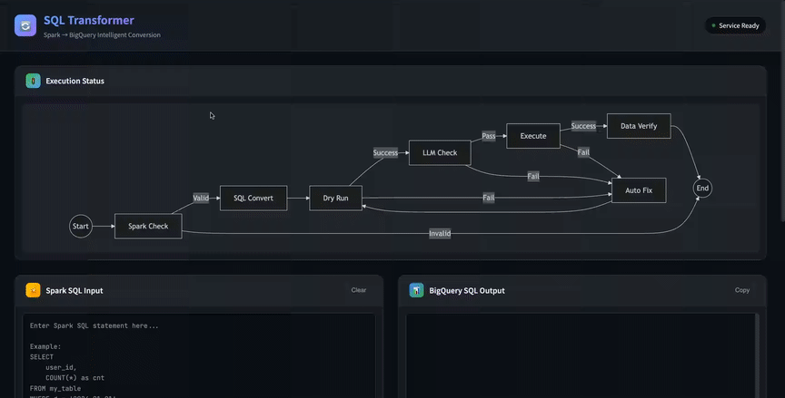
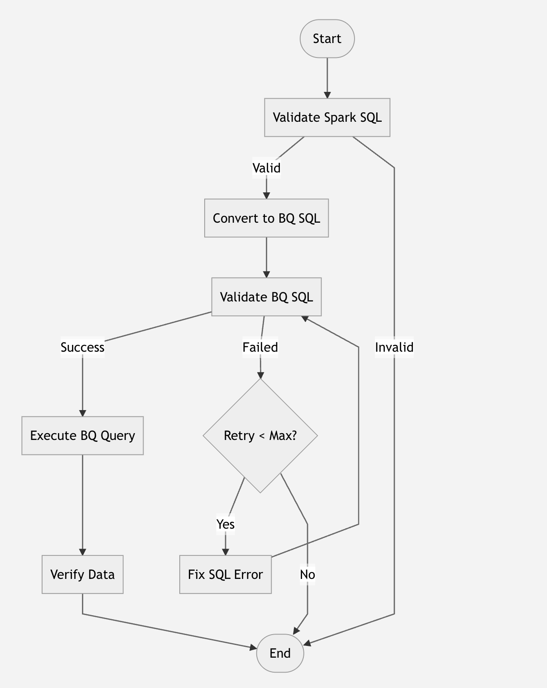

# Spark to BigQuery SQL Migration Agent

An intelligent, automated service designed to convert Spark SQL queries into BigQuery-compatible SQL. Built on top of **LangGraph**, it orchestrates a sophisticated workflow that goes beyond simple translation. It employs **Google Gemini** (Vertex AI) to understand dialect nuances, validates generated SQL using real BigQuery APIs (Dry Run), and iteratively fixes errors through a self-correction loop.



## ✨ Features

- **Spark SQL Validation**: Uses LLM to validate the syntax of input Spark SQL.
- **Intelligent Conversion**: Converts Spark SQL to BigQuery SQL, handling functions, data types, and syntax differences.
- **Smart Chunking**: Automatically splits large or complex queries (CTEs, Unions, etc.) into manageable chunks for high-quality translation.
- **Dual Validation Modes**:
  - **Dry Run Mode** (Recommended): Uses BigQuery API for real validation (requires GCP credentials).
  - **LLM Mode**: Uses LLM for syntax checking (offline mode).
- **Auto-Correction**: Automatically iterates to fix SQL errors based on validation feedback (up to 3 retries).
- **Data Verification**: Optional step to verify execution results against ground truth data.

## 🏗 System Architecture

The core of the system is a stateful graph-based agent implemented with `LangGraph`. The workflow proceeds through a series of nodes, each responsible for a specific stage of the migration process.



### Workflow Steps

1.  **Validate Spark SQL**: Checks if the input Spark SQL is syntactically valid to prevent wasting resources.
2.  **Convert to BQ SQL**: Translates the Spark SQL to BigQuery dialect using intelligent chunking.
3.  **Validate BQ SQL**:
    -   **Dry Run**: Confirms 100% validity regarding syntax and schema resolution using BigQuery API.
    -   **LLM Check**: Fallback syntax check.
4.  **Fix / Auto-Correction**: Identifies errors and regenerates corrected query.
5.  **Execute**: Runs the valid BigQuery SQL (e.g., creating a target table).
6.  **Verify Data**: Compares execution results against "Ground Truth" tables using row count or full content comparison.

## 📂 Project Structure

```
trans/
├── requirements.txt          # Dependencies
├── env.example              # Environment variables example
├── src/
│   ├── __init__.py
│   ├── main.py              # FastAPI Entry point
│   ├── agent/
│   │   ├── __init__.py
│   │   ├── graph.py         # LangGraph workflow definition
│   │   ├── state.py         # Agent state definition
│   │   └── nodes.py         # Node implementations
│   ├── services/
│   │   ├── __init__.py
│   │   ├── bigquery.py      # BigQuery Dry Run service
│   │   ├── llm.py           # LLM service (Gemini)
│   │   └── validation.py    # Validation service
│   ├── prompts/
│   │   ├── __init__.py
│   │   └── templates.py     # Prompt templates
│   └── schemas/
│       ├── __init__.py
│       └── models.py        # Pydantic models
└── README.md
```

## 🚀 Installation

1. Create and activate a virtual environment:

```bash
python -m venv venv
source venv/bin/activate  # Linux/macOS
# OR
.\venv\Scripts\activate  # Windows
```

2. Install dependencies:

```bash
pip install -r requirements.txt
```

3. Configure environment variables:

```bash
cp env.example .env
# Edit .env file with your configurations
```

## ⚙️ Configuration

### LLM Configuration (Google Gemini)

| Variable | Description |
|----------|-------------|
| `LLM_PROVIDER` | Set to `gemini` |
| `GOOGLE_API_KEY` | Google Gemini API Key |
| `GEMINI_MODEL` | Gemini Model Name (default: `gemini-1.5-flash`) |

### BigQuery Validation Configuration

| Variable | Description |
|----------|-------------|
| `BQ_VALIDATION_MODE` | Validation mode: `dry_run` or `llm` (default: `dry_run`) |
| `GOOGLE_PROJECT_ID` | GCP Project ID (Required for `dry_run`) |
| `GOOGLE_APPLICATION_CREDENTIALS` | Path to GCP Service Account JSON (Required for `dry_run`) |

## 🏃 Running the Service

```bash
# Development mode (auto-reload)
python -m src.main

# OR using uvicorn directly
uvicorn src.main:app --host 0.0.0.0 --port 8000 --reload
```

Once started, access:
- **API Documentation**: http://localhost:8000/docs
- **Health Check**: http://localhost:8000/health

## 📝 API Usage

### Convert SQL

**Request:**

```bash
curl -X POST http://localhost:8000/convert \
  -H "Content-Type: application/json" \
  -d '{
    "spark_sql": "SELECT date_format(dt, \"yyyy-MM-dd\") as formatted_date, collect_list(name) as names FROM my_table GROUP BY dt"
  }'
```

**Response:**

```json
{
  "success": true,
  "spark_sql": "...",
  "bigquery_sql": "SELECT FORMAT_DATE('%Y-%m-%d', dt) as formatted_date, ARRAY_AGG(name) as names FROM my_table GROUP BY dt",
  "validation_success": true,
  "validation_mode": "dry_run"
}
```
